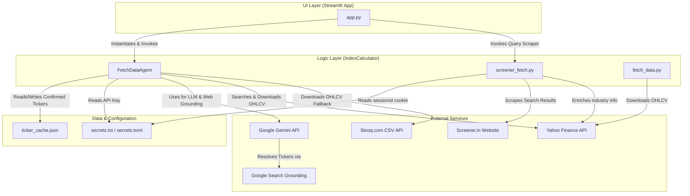
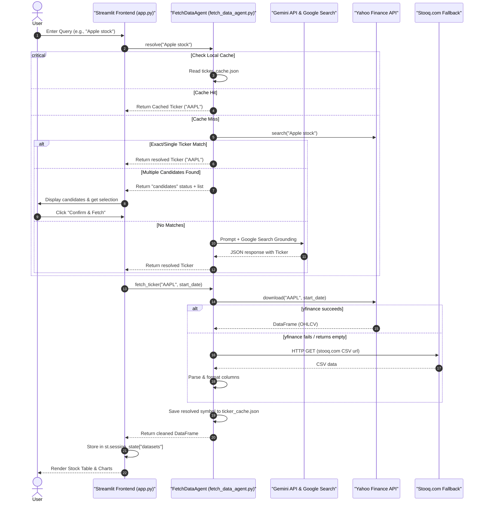
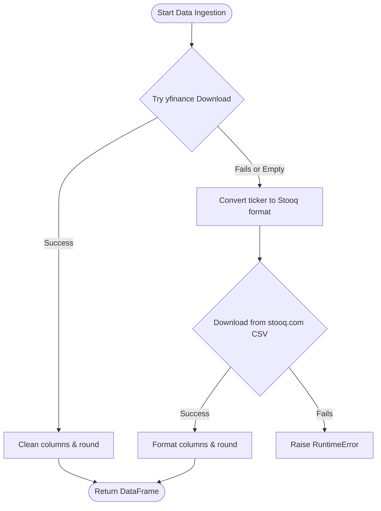

# WAIFU (Web-grounded AI Financial Indexing Utility) System Documentation

Welcome to the comprehensive technical documentation for **WAIFU (Web-grounded AI Financial Indexing Utility)**, a premium dashboard and computational engine for stock data acquisition, investment screening, and portfolio backtesting. 

This document details the architectural layout, core subsystems, data pathways, mathematical formulas, and external API dependencies of the WAIFU platform.

---

## 1. Subsystem Overview

The WAIFU platform is divided into two primary logical spaces:
1. **Frontend Layer (`UI/`)**: A rich, interactive Streamlit application that handles visualization, session state management, user selections, and real-time portfolio performance calculation.
2. **Computational Layer (`IndexCalculator/`)**: A backend module specializing in multi-source data downloading (with automatic failover), web-scraping for investment screening, and web-grounded LLM ticker resolution agents.

### Core Subsystems and File Map

*   **User Interface**: [app.py](file:///d:/Workspace/waif/UI/app.py) orchestrates the multi-page dashboard, handles page routing, manages session cache, renders stock charts, and computes portfolio rebalancing.
*   **Base Ticker Downloader**: [fetch_data.py](file:///d:/Workspace/waif/IndexCalculator/fetch_data.py) provides baseline ticker resolution heuristics and pulls raw financial records via Yahoo Finance.
*   **AI Data Acquisition Agent**: [fetch_data_agent.py](file:///d:/Workspace/waif/IndexCalculator/fetch_data_agent.py) acts as a resilient data retrieval engine that combines LLM reasoning (Gemini API), web-search grounding, exact ticker matching, and Stooq fallback mechanics.
*   **Screener Scraper**: [screener_fetch.py](file:///d:/Workspace/waif/IndexCalculator/screener_fetch.py) connects to `screener.in` to parse complex stock filter queries, paginates results, and enriches them with industry categories.

---

## 2. Architecture & Component Topology

WAIFU is designed for decoupled operations. The frontend layer communicates with the logic layer via function calls, passing state parameters, query logs, and data structures.

### Component Relationship Diagram



---

## 3. Data Flow Pathways

The system handles data ingestion and computation via two primary workflows: **AI Data Fetching** and **Portfolio Backtesting**.

### 3.1 AI Ticker Resolution and Data Acquisition
The following sequence diagram outlines how a user's natural language input (e.g. "Reliance industries", "Apple stock") is converted into a structured daily price series:



### 3.2 Screener and Sector Classification
1. The user inputs a financial filter query (e.g. `PE < 15 AND ROE > 20%`).
2. [app.py](file:///d:/Workspace/waif/UI/app.py#L388-L428) retrieves the session cookie from `st.secrets` or local configuration and invokes `run_screener_query`.
3. [screener_fetch.py](file:///d:/Workspace/waif/IndexCalculator/screener_fetch.py#L268-L315) logs in, parses results across multiple pages, and creates raw stock tables.
4. Each stock ticker is enriched by calling `yfinance` to fetch its `industry` or `sector`.
5. The frontend displays the stocks neatly grouped inside expandable industry accordion tabs.

---

## 4. Technical Deep Dive

Let's examine how each primary operation is coded and implemented, detailing exact files, classes, and logic blocks.

### 4.1 Stock Symbol Resolution Engine
Stock ticker resolution is handled inside [fetch_data_agent.py](file:///d:/Workspace/waif/IndexCalculator/fetch_data_agent.py). It operates in a 3-tier sequence:

1.  **Cache Verification**: The query (normalized to uppercase) is looked up in the static symbol map `_BASE_MAP` and the dynamically generated [ticker_cache.json](file:///d:/Workspace/waif/IndexCalculator/ticker_cache.json) via [_load_cache](file:///d:/Workspace/waif/IndexCalculator/fetch_data_agent.py#L48-L56). If present, it resolves immediately without external calls.
2.  **API Autocomplete Search**: If there is a cache miss, the agent invokes [_yf_search](file:///d:/Workspace/waif/IndexCalculator/fetch_data_agent.py#L102-L108) using the `yf.Search()` utility:
    *   If an **exact ticker match** (e.g. query matches ticker base exactly) or **single unambiguous result** occurs, it resolves to `"direct"` status immediately.
    *   If multiple search quotes are returned, the status is set to `"candidates"` and returned, allowing the Streamlit UI to show candidate choices under [AI Fetch Page Candidate Selection](file:///d:/Workspace/waif/UI/app.py#L245-L329).
3.  **Web-Grounded LLM Grounding**: If the autocomplete search yields no matches, the query is passed to [_gemini_resolve](file:///d:/Workspace/waif/IndexCalculator/fetch_data_agent.py#L112-L195). The agent issues a structured request to `gemini-2.0-flash` with Google Search tool enabled:
    *   The model receives a detailed system prompt defining regional exchanges, indices, and currency prefixes.
    *   The model executes Google searches to retrieve real-time data, and parses the findings.
    *   The model responds with a JSON string indicating direct resolution (`status: "direct"`) or multiple candidates (`status: "candidates"`). This JSON is parsed via regex and loaded into a [ResolveResult](file:///d:/Workspace/waif/IndexCalculator/fetch_data_agent.py#L65-L76) container.

### 4.2 Multi-Source Downloader with Auto-Failover
Data downloading is executed in [FetchDataAgent.fetch_ticker](file:///d:/Workspace/waif/IndexCalculator/fetch_data_agent.py#L379-L434).



1.  **yfinance Pipeline**: The agent requests records from the Yahoo Finance API using [_yf_fetch](file:///d:/Workspace/waif/IndexCalculator/fetch_data_agent.py#L199-L219). If data returns successfully, it removes multi-index levels (if nested), formats the columns as `["Open", "High", "Low", "Close", "Volume"]`, and rounds numbers.
2.  **Stooq Failover Pipeline**: If `_yf_fetch` fails or returns an empty DataFrame, the agent converts the ticker format using [_to_stooq_ticker](file:///d:/Workspace/waif/IndexCalculator/fetch_data_agent.py#L232-L240):
    *   Global index prefixes are translated (e.g. `^NSEI` $\rightarrow$ `^NF`, `^NSEBANK` $\rightarrow$ `^BNF`, `^GSPC` $\rightarrow$ `^SPX`).
    *   Indian stock suffixes are swapped (e.g. `.NS` / `.BO` $\rightarrow$ `.IN`).
3.  **HTTP Request & Parse**: [_stooq_fetch](file:///d:/Workspace/waif/IndexCalculator/fetch_data_agent.py#L242-L267) issues a `requests.get` to `https://stooq.com/q/d/l/` with parameters for symbol and date range. The downloaded CSV data is processed, sorted chronologically, and standardized to match the yfinance schema.

### 4.3 Portfolio Calculation & Backtesting Engine
The Portfolio Builder in [app.py (Portfolio Builder)](file:///d:/Workspace/waif/UI/app.py#L471-L711) handles complex data alignment and historical backtesting.

#### 1. Data Alignment & Normalization
Before evaluating the portfolio, daily price series are aligned:
*   Close prices for all selected instruments are compiled into a single Pandas DataFrame.
*   The indexes are cast to `DatetimeIndex` and sorted chronologically.
*   Missing days (due to trading holidays, early closures, or index mismatch) are resolved by **forward-filling (`ffill()`)** and then dropping any leading rows containing `NaN` values via `dropna()`.

#### 2. Position Allocation Mathematics
On the initial date $t_0$, the user allocates a weight $w_k$ to each stock $k$ in the selection set $K$. The initial value of the position is defined as:
$$V_k(t_0) = w_k \times 100$$
The initial share count $S_k$ bought for stock $k$ based on its closing price $C_k(t_0)$ is calculated as:
$$S_k = \frac{w_k \times 100}{C_k(t_0)}$$

On any trading day $t_i$, the total portfolio value $P(t_i)$ is the sum of the value of all individual asset shares:
$$P(t_i) = \sum_{k \in K} S_k \times C_k(t_i)$$

#### 3. Portfolio Rebalancing Mathematics
When the rebalancing interval $N$ is enabled (i.e. $N > 0$), the shares are updated every $N$ trading days.
On a rebalance day $t_{rebal}$:
1.  **Calculate Portfolio Value**: Compute the aggregate value of the portfolio immediately before rebalancing:
    $$V_{total} = \sum_{k \in K} S_k^{old} \times C_k(t_{rebal})$$
2.  **Redistribute Allocation**: Sell existing shares and purchase new shares such that the monetary value of each stock aligns with the original target fraction:
    $$\text{Target Fraction } F_k = \frac{w_k}{\sum_{j \in K} w_j}$$
    $$\text{New Share Count } S_k^{new} = \frac{F_k \times V_{total}}{C_k(t_{rebal})}$$
3.  **Audit Logging**: The transition details (Asset Value Before vs. Asset Value After) are logged into the rebalance ledger `rebalance_log` and rendered in the UI.

#### 4. Financial Performance Metrics
The system calculates key performance metrics over the backtest period:
*   **Holding Period ($Y$)**: The difference between the first and last dates in years:
    $$Y = \frac{\text{Date}(t_{last}) - \text{Date}(t_0)}{365.25}$$
*   **Total Portfolio Return ($R_p$)**:
    $$R_p = \left( \frac{P(t_{last}) - P(t_0)}{P(t_0)} \right) \times 100$$
*   **Portfolio CAGR ($CAGR_p$)**:
    $$CAGR_p = \left[ \left( \frac{P(t_{last})}{P(t_0)} \right)^{\frac{1}{Y}} - 1 \right] \times 100$$
*   **Benchmark CAGR ($CAGR_b$)**: Given benchmark closing prices $B(t)$, its CAGR is calculated as:
    $$CAGR_b = \left[ \left( \frac{B(t_{last})}{B(t_0)} \right)^{\frac{1}{Y}} - 1 \right] \times 100$$
*   **Alpha vs. Benchmark ($\alpha$)**: The arithmetic excess return of the portfolio relative to the benchmark:
    $$\alpha = R_p - R_{benchmark}$$

---

## 5. External APIs & Web Scraping

WAIFU integrates with four external services to retrieve real-time and historical financial information:

| External Service | API Interface / Protocol | Purpose | Authentication |
| :--- | :--- | :--- | :--- |
| **Google Gemini API** | Google GenAI Python SDK (`google-genai` 1.0.0+) | LLM reasoning & structural JSON extraction of ambiguous stock queries | API Key (`GEMINI_API_KEY`) via environment or secrets |
| **Google Search Grounding** | Grounding Tool in Gemini API | Live web search to locate the correct ticker for natural language queries | Handled transparently by Gemini API config |
| **Yahoo Finance API** | `yfinance` PyPI client library (HTTP endpoints) | Autocomplete stock search and primary downloader for daily OHLCV series | Public access (no authentication required) |
| **Stooq.com** | Direct HTTP GET to CSV endpoint | Reliable secondary fallback for daily OHLCV series when yfinance fails | Public access (User-Agent header spoofing) |
| **Screener.in** | HTTP GET scraping using `requests` & `BeautifulSoup` | Runs raw SQL-like equity screening queries and scrapes results | Authenticated via `sessionid` session cookie |

---

## 6. Setup & Configuration Guide

Follow these steps to run WAIFU locally on your machine.

### Prerequisites
Make sure you have Python 3.9+ installed. Install all dependencies from [requirements.txt](file:///d:/Workspace/waif/requirements.txt):
```bash
pip install -r requirements.txt
```

### Configuration
1.  **Gemini API Key**:
    *   Get a free API key from [Google AI Studio](https://aistudio.google.com/apikey).
    *   Create a file at `.streamlit/secrets.toml` inside the repository root and add your key:
        ```toml
        GEMINI_API_KEY = "your_actual_gemini_api_key"
        ```
    *   Alternatively, set it in your environment:
        ```powershell
        $env:GEMINI_API_KEY="your_actual_gemini_api_key"
        ```

2.  **Screener.in Session Cookie**:
    *   Open `screener.in` in your browser and log in.
    *   Press `F12` to open Developer Tools, go to **Application / Storage** $\rightarrow$ **Cookies**, and copy the value of the `sessionid` cookie.
    *   Create a file called `secrets.txt` in the root of the repository (`d:/Workspace/waif/secrets.txt`) and paste the value:
        ```text
        SCREENER_SESSION=your_sessionid_cookie_value
        ```
    *   Alternatively, define it in `.streamlit/secrets.toml`:
        ```toml
        SCREENER_SESSION = "your_sessionid_cookie_value"
        ```

### Launching the Dashboard
Start the Streamlit application by running:
```bash
streamlit run UI/app.py
```
This launches a browser window pointing to your local environment (typically `http://localhost:8501`).
